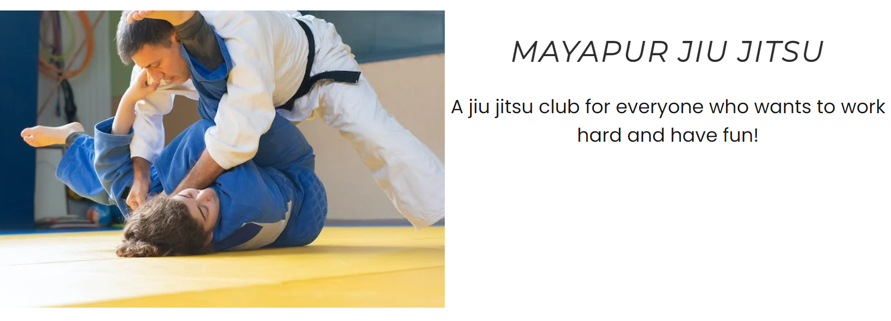
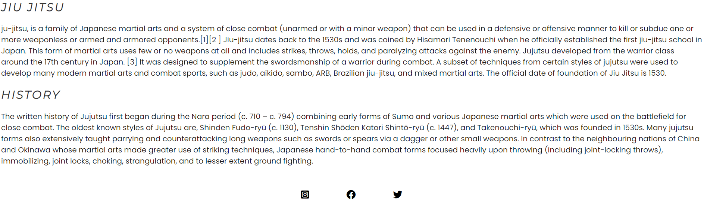
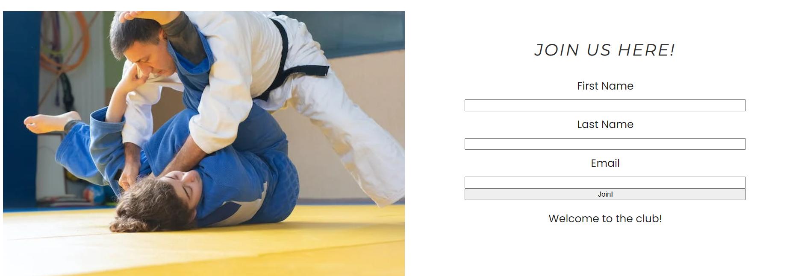

 # MAYAPUR JUI JITSU
 https://rasmus1111.github.io/project-1-b/  
 For educational purpose only!
 .png)

 The website was created for anyone intrested in training jui jitsu in Mayapur so that they can get some basic information and join the club.

 ## Features

  A fully functional responsive navigation bar for all three pages.
  An input form for people to jion the club and media links.
  Responsive design for multiple size screens.

## Existing features

- __Navigation Bar__
  
  - A fully functional navigation bar for all three pages HOME, JIU JITSU and JOIN. 
  - Keeping  the same design for all three pages makes it easier for the user to navigate.
  
  

 - __Main section__
      - A background of two peaple doing jiu jitsu and heading.
      - There is fun text welcoming everyone on the right.
      

 - __Footer__
   - The footer has media links relevent to the site.
   - The links are there for the users, so that they can follow and engage with the club in different ways.
   

- __Jiu jitsu__
   - The jiu jitsu page gives more information about jiu jitsu and its 
     history.
   - This page gives the costumer a comprehensive overview of the subject, 
     so they dont have to look elsewhere.

     

- __The join page__
   - This page is for peaple to join the jiu jitsu club.
   - It is a simple input form, making it easy for those interested.
   

 ## Testing  
  
   Both html and css have been tested on this site. Also, the site has been tested on multiple screen sizes ranging from phone to desktop.

## Validator Testing 

- __HTML__

    - There are no errors when testing the code with the official W3C validator. https://validator.w3.org/
 
- __CSS__

   - There are no errors when testing the code with the official (Jigsaw) validator. https://jigsaw.w3.org/css-validator/

## Deployment 
   
 - The site was deployed to GitHub pages. The steps to deploy are as follows:
 - In the GitHub repository, navigate to the Settings tab

 - From the source section drop-down menu, select the Master Branch

- Once the master branch has been selected, the page will be automatically 
  refreshed with a detailed ribbon display to indicate the successful deployment.
   
Link: https://rasmus1111.github.io/project-1-b/

## Credits 
   A lot of coding help for this website came from Code Institute`s tutors and lessons.
  
## Content 
- Informational text for jiu jitsu and history where taken from "wikipedia".
  https://en.wikipedia.org/wiki/Jujutsu

- The icons where taken from "Font Awesome" https://fontawesome.com/icons

## Media 

- the background image was taken from "pixels.com" https://www.pexels.com/sv-se/

  

  

  
    

  

 

  

 

 
 